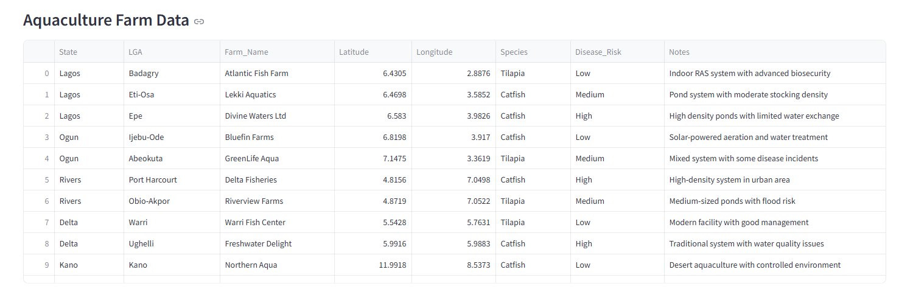
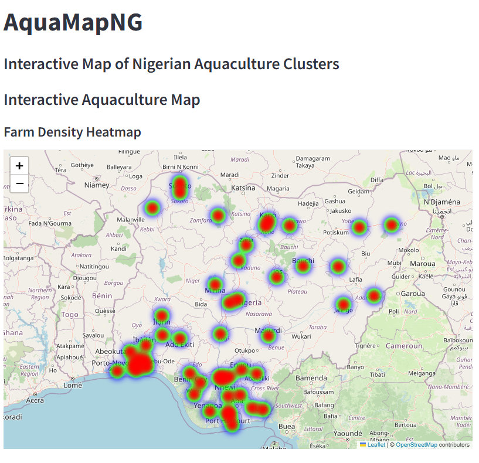
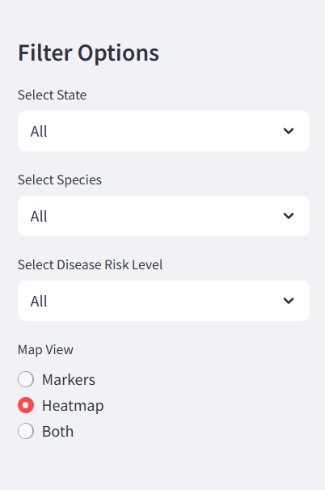
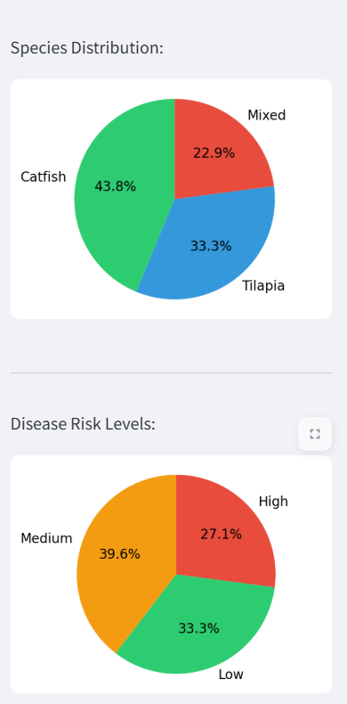

# AquaMapNG 🐟

An interactive web application that visualizes aquaculture clusters across Nigeria. This project maps fish farms, species farmed, and disease risk levels to demonstrate how GIS and data visualization can support smarter policy, disease monitoring, and resource allocation in Nigeria's aquaculture sector.

# Screenshots

## Main View with Markers

*The main interface showing aquaculture farms with color-coded risk markers.*

## Heatmap Visualization

*Heatmap showing the density of aquaculture farms across Nigeria.*

## Filtered View

*The application with filters applied to show specific data subsets.*

## Statistics Dashboard

*Charts and statistics showing distribution of species and disease risk levels.*


## 🚀 Features

- **Interactive Map**: View all fish farms with color-coded markers based on disease risk levels
- **Filtering Options**: Filter farms by state, species, and disease risk level
- **Detailed Information**: Click on any marker to view detailed information about each farm
- **Statistics**: View summary statistics in the sidebar showing farm counts by state
- **Data Table**: See the filtered data in a table format below the map

## 📋 Tech Stack

- **Frontend**: Streamlit
- **Data Processing**: Pandas
- **Map Visualization**: Folium
- **Data Source**: CSV (simulated data)

## 📁 Project Structure

```
AquaMapNG/
├── data/
│   └── aquaculture_clusters.csv
├── assets/
│   └── preview.png (optional)
├── app.py
├── README.md
└── requirements.txt
```

## 🛠️ Setup and Installation

1. **Clone the repository**:
   ```
   git clone https://github.com/temabef/AquaMapNG.git
   cd AquaMapNG
   ```

2. **Create a virtual environment** (optional but recommended):
   ```
   python -m venv venv
   source venv/bin/activate  # On Windows: venv\Scripts\activate
   ```

3. **Install the dependencies**:
   ```
   pip install -r requirements.txt
   ```

4. **Run the application**:
   ```
   streamlit run app.py
   ```

5. **Access the application**:
   Open your browser and go to `http://localhost:8501`

## 📊 Data

The application uses simulated data for demonstration purposes. The data includes:

- Farm information (name, location)
- Species farmed
- Disease risk levels
- Notes about each farm

In a real-world implementation, this data would be collected from actual farms through surveys or government databases.

## 🔄 Future Enhancements

- **Choropleth Map**: Add state-level statistics with colored polygons
- **Heatmap**: Show areas with high farm density
- **Data Upload Feature**: Allow users to upload their own datasets
- **Export Feature**: Export the map and data as images or reports
- **Advanced Analytics**: Add statistical analysis of farm distributions and disease patterns

## 📄 License

This project is licensed under the MIT License - see the LICENSE file for details.

## 👥 About the Author

This project was created by Saheed Kolawole as a portfolio demonstration for GIS, data visualization, and web application development skills.

## 🙏 Acknowledgments

- This project uses simulated data for educational and demonstration purposes
- Built with open-source tools including Streamlit, Pandas, and Folium 
